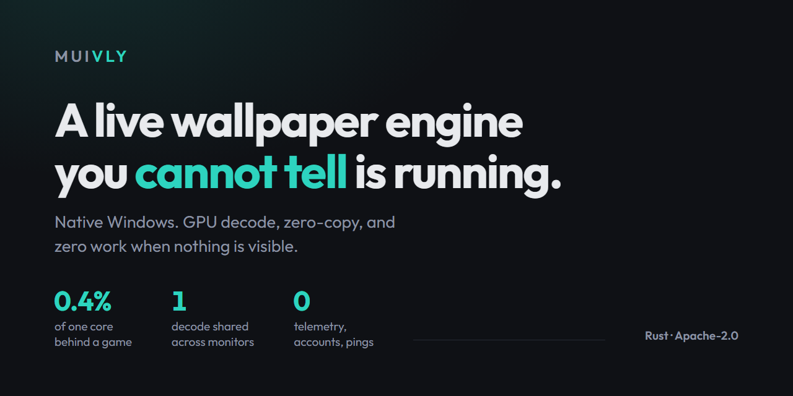

<div align="center">



# Muivly

**A native live wallpaper engine for Windows, built for the machines that
struggle with the alternatives.**

[](https://github.com/heraklessii/Muivly/actions/workflows/ci.yml)
[](LICENSE)
[](https://rustup.rs/)
[](#requirements)

[**Project page**](https://heraklessii.github.io/Muivly) ·
[Releases](https://github.com/heraklessii/Muivly/releases) ·
[Design notes](docs/) ·
[Contributing](CONTRIBUTING.md)

</div>

> [!NOTE]
> **v0.1.0 is the first release, and it is a first release.** Muivly plays a
> video wallpaper on every monitor, decoded on the GPU, stops decoding
> entirely when nothing is visible, and has a settings window that lives in
> the system tray. Memory is still well above where it needs to be, and this
> has been tested on far fewer machines than Windows has shapes. If something
> is wrong on yours, [an issue](https://github.com/heraklessii/Muivly/issues)
> with the output of `muivly-core --caps` in it is the most useful thing you
> can send.

## What it costs

This is the whole argument. Two monitors on a hybrid laptop — integrated
*and* discrete GPU, so two decoders, the worst case — playing 1080p at 30 fps:

| | CPU, share of one core |
|---|---|
| Desktop visible | 13.7% |
| Every monitor covered by a window | **0.4%** |

Not "slows down". Stops. And after twenty seconds out of sight the decoders
are handed back too, so the memory goes with the CPU time.

Memory is the honest weak spot. Worst case again — a 4K clip on both GPUs:

| | Working set | Private bytes | Threads |
|---|---|---|---|
| Before | 610 MB | 790 MB | 80–82 |
| Now | **540 MB** | **706 MB** | 79–81 |

None of these numbers are yours. To get yours:

```bash
muivly-core --benchmark "C:\path\to\wallpaper.mp4"
```

That plays the wallpaper for thirty seconds and prints what it cost on your
machine — the real engine, the real desktop, no separate measuring path.

## Why

Wallpaper Engine is good software, but on an old laptop with an integrated GPU
and 8 GB of RAM it is a tax you pay all day, every day. Muivly targets exactly
those machines. The goal is not "it runs" — it is "it runs and you cannot tell
it is running."

That goal is not a preference here. It is what every design decision is
answerable to, and a change that breaks one of the rules below will not be
merged no matter how well it works.

| | |
|---|---|
| **GPU decode, always** | Media Foundation with D3D11VA. There is deliberately no CPU fallback: it would blow the CPU budget on the machines this is for. |
| **Zero-copy** | A decoded frame stays on the GPU as a D3D11 texture. It never round-trips through system memory to reach the screen. |
| **One decode, not one per monitor** | The same video on three screens is decoded once and the texture shared. Screens on *different* GPUs get one decode each — sharing across adapters would break zero-copy. |
| **Nothing visible, nothing running** | Fullscreen app in front, desktop hidden: rendering stops, then the decoders are released and the memory with them. The last frame stays on screen. |
| **An empty chair is nobody watching** | A visible desktop nobody is in front of costs the full frame rate, and no occlusion check catches it. After five minutes without a keypress the picture stands still, and comes back on the first one. |
| **Out of the way when the machine is busy** | The wallpaper does not get more expensive when you start a build; everything else does. Above 80% of the machine it drops to 10 fps until things quieten down. |
| **Unplugged is a different budget** | On battery the frame rate drops; under Windows' battery saver it stops moving altogether. Both on by default. |
| **The settings window is a separate process** | It uses a WebView, which costs RAM. That is a cost you pay while the settings window is open, and never while the wallpaper is running. |

## Set-up, in one choice

Seven separate dials decide what Muivly costs — frame rate, memory budget,
how long out of sight before the video is let go, how long the desk must be
empty, what to fall to while the machine is busy, and two for the battery.
Every one of them is a real choice, and every one of them asks a question
nobody opens a wallpaper app wanting to answer.

So they are one choice with four answers, from *barely touch this machine* to
*as good as it gets*. Every dial is still there behind them for whoever wants
one, and a set of values matching no level is shown as its own rather than
quietly corrected.

## Requirements

Windows 10 (1903+) or Windows 11, 64-bit. A GPU with hardware video decode —
essentially anything from 2014 onward, including integrated graphics.

HEVC and AV1 need Microsoft's free codec extensions from the Store; Windows
ships neither. Muivly names the missing one when a file needs it, rather than
reporting that the file would not open.

## Getting it

From the [Releases page](https://github.com/heraklessii/Muivly/releases), in
two shapes:

| File | What it is |
|---|---|
| `Muivly-x.y.z-setup.exe` | Installer. Per user, no administrator prompt. |
| `Muivly-x.y.z-portable.zip` | Unzip and run. No installer, no registry writes. |

Every file has a `.sha256` next to it, so you can check what you downloaded is
what was built.

Windows will warn you about an unsigned installer. It is unsigned because a
code-signing certificate costs a few hundred a year and this project has no
money behind it; the alternative to the warning is not a safer download, it is
no download. Build it yourself if you would rather not take that on trust —
the instructions are below and there is one dependency.

winget submission is on the list but not done yet; `winget install
heraklessii.Muivly` will not work until it is.

## Trying it

Two processes: `muivly-core.exe` is the engine and `muivly-ui.exe` is the
settings window. The UI can start the engine for you, or you can run the
engine directly and point it at a video file:

```bash
muivly-core "C:\path\to\wallpaper.mp4"
```

Ctrl+C stops it and restores your own wallpaper. Without a file it shows a
placeholder gradient instead.

<details>
<summary><b>Check what Muivly detected about your hardware</b></summary>

<br>

```bash
muivly-core --caps
```

```
system: 15654 MB RAM, power: AC
adapter: AMD Radeon(TM) Graphics [Integrated] 1002:15bf vram=419 MB decode=h264+hevc+hevc10+vp9+av1
  output: \.\DISPLAY5 2560x1440 @180Hz (primary)
adapter: NVIDIA GeForce RTX 4050 Laptop GPU [Discrete] 10de:28a1 vram=5920 MB decode=h264+hevc+hevc10+vp9+av1
  output: \.\DISPLAY1 1920x1080 @144Hz
tier: Mid -> 30 fps, max 2560x1440, distinct videos: false
reason: integrated GPU
```

Muivly picks its defaults from this: an integrated GPU gets 30 fps, a discrete
one 60, and the frame rate never exceeds your monitor's refresh rate or goes
above 30 on battery. Defaults, not limits — the settings window overrides all
of them.

If you are filing a bug, paste this output into the issue.

</details>

## Shaders

Drop in a `.hlsl` file with one `mainImage(float2 uv)` function and it plays
like anything else — no decoder, no picture buffers, no codec threads behind
it. It is the lightest thing Muivly can put on a desktop, by a wide margin.
There are examples in [`examples/shaders`](examples/shaders).

<details>
<summary><b>Sliders, Shadertoy import, and reading the sound</b></summary>

<br>

A file can declare its own sliders, which appear in the settings window:

```hlsl
// param speed 0.1 3.0 1.0 How fast it moves
```

Shadertoy shaders work too. Save one as `.glsl` or `.frag` and Muivly
translates it on the way in — line for line, so a compile error still points
at the line you wrote. Shaders that sample a texture channel (`iChannel0`)
cannot work, and say so rather than failing obscurely.

A shader can also listen: `iLevel` is how loud the machine is and
`iBand(0..7)` splits that into bands, which is what
[`spectrum.hlsl`](examples/shaders/spectrum.hlsl) draws. The capture that
feeds it is opened only while a shader that reads it is on screen, has no
thread of its own, and is drained on a frame the engine was drawing anyway.

</details>

## Where the memory goes

The 85 MB that came off it was Media Foundation's queue of decoded frames,
kept for smooth playback of a film — a wallpaper has nothing to seek through.
Asking the decoder for a smaller pool of output samples was tried too, and
does nothing: those knobs set a floor, and the floor that matters is the
codec's own reference-frame requirement.

What is left is almost entirely two decoders' picture buffers, and the threads
are Media Foundation's shared work queue. Both need a different shape, not a
smaller number.

Both of those shapes now exist, and **Lighten** is where they land. The size
of a picture buffer is the codec's reference-frame count times the size of the
frame, and neither belongs to the engine at playback time — but both belong to
whoever wrote the file. So Lighten rewrites a clip once, on the GPU, at the
size the desktop actually is *and* with a single reference frame instead of
the four or more an encoder picks by default. A 4K loop on a 1080p laptop
stops decoding four times the pixels that screen can show, permanently, with
no scaler in the playback path to pay for it. The library flags a clip bigger
than your largest screen rather than waiting for you to suspect it.

There is also a memory budget in the settings, for people who would rather set
a number than convert a file.

## Architecture

Two processes that talk over a named pipe:

```
wallpaper-core/   Rust native binary. The engine. Keeps running — and keeps its
                  memory profile — whether or not the UI is open.
  caps/           GPU/system probe. Runs once at startup.
  decoder/        Media Foundation + D3D11VA hardware decode.
  compositor/     WorkerW injection, multi-monitor shared D3D11 texture.
  power/          Fullscreen/occlusion detection, render throttle and pause,
                  and the battery policy.
  audio/          WASAPI playback, and standing down for other applications.
  ipc/            Named pipe server.

wallpaper-ui/     Tauri v2 + React. The settings panel, and nothing else.
                  Wallpapers are never rendered here. Closing the window
                  hides it to the tray; the engine is untouched either way.
```

Design notes and the reasoning behind each choice live in [`docs/`](docs/) —
`decisions.md` in particular records what was considered and rejected.

<details>
<summary><b>Building from source</b></summary>

<br>

You need [Rust](https://rustup.rs/) and the MSVC toolchain (Visual Studio Build
Tools with the "Desktop development with C++" workload and the Windows SDK).

```bash
git clone https://github.com/heraklessii/Muivly.git
```

The engine:

```bash
cargo build --release
```

It lands in `target/release/muivly-core.exe`, about 200 KB, with exactly one
dependency: the `windows` crate (Win32 API bindings).

The settings window needs Node 24+. It is a separate Cargo workspace, so the
engine build above never pulls Tauri in:

```bash
cd wallpaper-ui && npm install && npx tauri build --no-bundle
```

</details>

## Privacy

Muivly does not phone home. No telemetry, no analytics, no update pings you
did not ask for, no account.

It goes online in exactly one place: the **Discover** view, which lists free
wallpapers from [motionbgs.com](https://motionbgs.com). Nothing is sent but
the request itself — no identifier, no history, no account — and the engine
refuses to talk to any host other than that one. Close the view and Muivly is
offline again. Everything else works with no connection at all.

<details>
<summary><b>What it writes, and what it puts back</b></summary>

<br>

Installing it writes to three places in your own registry, all optional and
all switchable from the settings window: the start-up entry, the "Muivly duvar
kağıdı yap" item in Explorer's right-click menu, and — only if you switch it
on — the accent colour. Nothing is written outside `HKEY_CURRENT_USER` and
`%APPDATA%\Muivly`, which is why the installer never asks for administrator
rights.

The accent colour is the only one that overwrites something you already had,
so it is the only one that comes with a promise: your previous colours are
saved before the first write, and put back when you switch it off, when the
engine quits, or on the next start if the engine was killed before it could.

The idle detection reads the counter Windows already keeps for the whole
session. There is no input hook, and no keystroke is ever seen by Muivly. The
audio bands a shader can read come from a loopback capture of what your own
machine is playing, opened only while such a shader is on screen and closed
when it leaves; nothing is recorded and nothing leaves the machine.

</details>

## Roadmap

- [ ] Bring memory down further — a 4K clip on two GPUs is still ~700 MB
- [ ] Measured RAM/CPU comparison against the alternatives
- [ ] winget submission

<details>
<summary><b>Done so far</b></summary>

<br>

- [x] First release
- [x] Hardware capability detection
- [x] WorkerW injection, one D3D11 device per adapter, per-monitor surfaces
- [x] Occlusion detection — decoding and rendering stop when nothing is visible
- [x] Media Foundation decoder — hardware H.264/HEVC/VP9/AV1, zero-copy
- [x] Settings window — Tauri v2, closes to the system tray; four levels from
      "barely touch this machine" to "as good as it gets", with every dial
      still there behind them
- [x] Per-monitor wallpaper assignment
- [x] Local library and playlists, shuffled or in the order you wrote them
- [x] Frame pacing that holds — high-resolution timer, woken by the video's own
      frame times rather than a grid of ours
- [x] Decoding on its own thread, so a slow read never lands in a frame
- [x] Still images and animated GIFs
- [x] Sound, off by default, muted the moment nothing is visible
- [x] Brightness, saturation and blur
- [x] Start with Windows — the engine only, which restores its own last session
- [x] Tray menu: next wallpaper, pause, mute, quit
- [x] Import from Wallpaper Engine's workshop folders
- [x] Discover — free wallpapers from motionbgs.com, downloaded into the library
- [x] Live CPU and memory readout, measured by the engine itself
- [x] Battery-aware: a lower frame rate unplugged, frozen under battery saver
- [x] Ducking — the soundtrack steps back while another application is audible
- [x] Per-monitor fit, grade and frame rate; one wallpaper spanned across screens
- [x] Crossfade between wallpapers, and playback speed
- [x] Global shortcuts, and "set as wallpaper" in Explorer's right-click menu
- [x] Survives a monitor being plugged in, a resolution change, sleep, and an
      Explorer restart
- [x] `.muivly` packages — a wallpaper and its credit in one file
- [x] Stands still when nobody has touched the machine, and stands down when
      the machine is busy with something else
- [x] Lighten also cuts the encoder to one reference frame, which is the other
      half of what a decoder's memory is made of
- [x] Shaders with their own sliders, Shadertoy `.glsl` import, and eight
      bands of the sound for shaders that draw it
- [x] Scenes — a named arrangement of wallpapers across the screens
- [x] A slow drift for still photographs, with no decoder behind it
- [x] Optional: the Windows accent colour follows the wallpaper, and gives
      your own colours back when you switch it off
- [x] `--benchmark` — this README's table, measured on your machine

</details>

## Contributing

See [CONTRIBUTING.md](CONTRIBUTING.md). The short version: this project has a
few hard rules about how video gets on screen, and a change that breaks them
will not be merged no matter how well it works — the rules are the product.

## License

[Apache-2.0](LICENSE).
